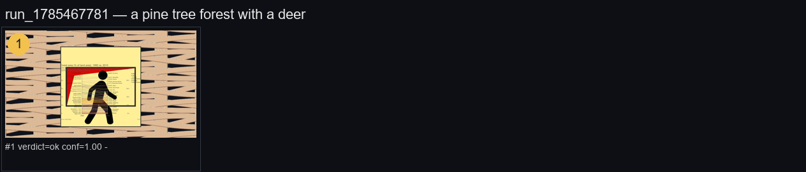

# Parallax Scene Maker — a VLM Art Director in a 3D Compositing Loop

**Architect: SAKSHAM SWAMI**

Give it a one-line scene brief — *"a misty mountain valley at dawn"* — and it
autonomously builds a layered 3D parallax scene: resolves a background,
midground, foreground and subject asset for the brief, stages them at real
depth in a Three.js scene, **takes a snapshot and asks a vision-language
model to critique its own composition**, applies the VLM's fixes (reposition,
rescale, or replace a wrong/missing asset), repeats until the VLM is
satisfied (or a hard iteration cap is hit), then renders an animated camera
dolly through the finished scene.



*Each frame above is one iteration of the review loop — the VLM's verdict,
confidence, and the issue it flagged are printed under the frame it judged.
This is a real contact sheet generated by this pipeline, unedited.*

## Why this is a real "director in the loop," not a script

The interesting engineering problem here isn't "call an LLM" — it's that a
small local vision model is being trusted to close a control loop over a 3D
scene, and small models are unreliable narrators. The system is built
assuming the model **will** occasionally return malformed, incoherent, or
out-of-range instructions, and treats that as the normal case to defend
against, not an edge case:

- **The pipeline never acts on a raw VLM response — only on the output of a
  strict validator** ([`vlm/contract.py`](vlm/contract.py), spec in
  [`vlm/CONTRACT.md`](vlm/CONTRACT.md)). Every move is clamped
  (`dx`/`dy` ≤ 0.3, `dScale` ≤ 0.2, normalized screen space) so a bad
  decision can't fling an element off-frame in one step. Unknown element ids
  are dropped rather than trusted. A `"fix"` verdict with zero actionable
  issues after filtering is rejected outright. Confidence below a floor
  forces a retry regardless of what verdict was claimed.
- **Fails closed, not open.** If the model returns something that can't be
  salvaged into a valid decision twice in a row, the loop accepts the current
  frame as final rather than looping forever or crashing the run.
- **A hard iteration cap (8)** bounds worst-case cost/latency no matter how
  indecisive the model is.

## Pipeline

```
Phase 0   Scene brief -> per-layer search queries + camera choreography
Phase 1   Asset resolution — vector-only, multi-source, provenance-logged
Phase 2   Stage each asset at its layer's real depth in a Three.js scene
Phase 3   Snapshot the current camera view
Phase 4   VLM review (contract-validated) of the snapshot + scene state
Phase 5   Apply fixes (reposition / rescale / replace an asset) -> Phase 3
          (repeat until verdict="ok", a contract violation, or 8 iterations)
Phase 6   Finalize: caption text, contact sheet, animated parallax render
```

### Asset resolution ([`downloader.py`](downloader.py))

A vector-only clip-art resolver spanning Iconify, Openverse, Wikimedia
Commons and (optionally) Pixabay — deliberately **not** photo libraries,
since flat vector art composites cleanly across depth layers without
lighting/perspective mismatches. Every download is logged to a CSV with its
source, license, and URL for provenance. Because a specific LLM-generated
query is often a full sentence ("the main subject is an air mattress on the
floor") against libraries far sparser than photo stock, `pipeline.py`
progressively simplifies a failing query (strip filler → first N words →
last words → last word) before giving up, and reports which variant
actually landed. Every Openverse/Wikimedia/Pixabay candidate additionally
gets a VLM relevance check before being accepted — catching mismatched
results keyword filtering alone can't (a returned logo, an unrelated map).

### Camera choreography ([`camera_choreographer.py`](camera_choreographer.py))

Turns the brief into an ordered list of camera moments (`focus` / `zoom_in` /
`zoom_out` / `pan` / `hold` per layer), which becomes a real 3D camera dolly
— `driver.set_camera` moving `z` toward/away from each layer's actual depth
plane — rather than faking parallax by sliding each layer's own sprite
position. (An older ASCII-map-based per-layer animation system remains as a
fallback for plain CLI usage with no storyboard.)

### The 3D stage ([`scene/`](scene/) + [`capture/capture.py`](capture/capture.py))

`scene/scene.js` is a small Three.js scene graph (`window.ParallaxScene`)
exposing `addElement`/`moveElement`/`setCamera`/`setAtmosphere`/`setText` —
plane geometry per asset, positioned at fixed per-layer Z depths, camera
always in front of every layer so a dolly move never clips through a plane.
`capture/capture.py`'s `SceneDriver` drives that page headlessly via
Playwright, mirroring the JS API 1:1 so the Python pipeline never touches JS
directly, and reads pixels back via `canvas.toDataURL()` rather than
`page.screenshot()` — the latter reliably returns a blank frame for this
WebGL context, one of several environment-specific bugs this project's
[`DEV_LOG.md`](DEV_LOG.md) documents finding and fixing in place, including
a subprocess pipe-deadlock in the local image-gen server (unread stdout pipe
filling its OS buffer and blocking the child on `write()` after a couple of
requests) and a `String.replace` gotcha where a 670KB minified vendor file
happened to contain a `$&`-style sequence that silently corrupted an inlining
step.

### Local asset generation ([`image_gen_server.py`](image_gen_server.py), [`local_gen.py`](local_gen.py))

A warm local Stable Diffusion HTTP server (fully offline) for wide,
seamless background strips and isolated subject cutouts when nothing
suitable exists in the vector libraries — with a `mode=bg` vs `mode=subject`
split, since backgrounds need full-bleed panoramic composition and subjects
need a clean cutout (`rembg`) on a plain background.

## Try it

Requires a local [Ollama](https://ollama.com) instance (`qwen3.5:0.8B` for
the VLM/text model) and Playwright's Chromium:

```bash
pip install -r requirements.txt
playwright install chromium
python pipeline.py "a misty mountain valley at dawn" --caption "Dawn"
```

Output lands under `output/<run_id>/` — staged assets, one PNG per review
iteration, the final render, a contact sheet, the VLM decision log
(`.jsonl`, one line per turn), and (if `ffmpeg` is on `PATH`) an animated
parallax `.mp4`.

`PIXABAY_API_KEY` is optional (enables one extra asset source; everything
else needs no key). No cloud API calls anywhere in the default path — VLM,
text generation, and image generation are all local.

## Disclaimer

Research/portfolio build. Downloaded assets carry the license of their
source (logged per-file in `log.csv`) — check before any commercial reuse.
